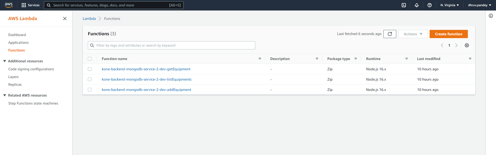

# KONE Fullstack Equipment assignment

## Work
Allows user to add new equipment, search for an equipment using equipment number and see the list of all equipments in the system.

> Defintely check the PDF file to know about the work done in detail.

## Tech Stack used
- **Frontend:** React(18.1.0) and TypeScipt, [React MUI(Material UI)](https://mui.com/)
- **Backend:** [Serverless](https://www.serverless.com/) , [MongoDB Atlas Cloud DB](https://www.mongodb.com/cloud/atlas) and AWS Console.
- **Other:** Axios(+Interceptors), Formik+Yup(For Forms and Validations)

## Sample Screenshots
### React Frontend on local

### Serverless Dashboard

### AWS Console

### Mongo DB Atlas Cloud Dashboard

### Postman

## Dev related Info

### Create react app
npx create-react-app my-app --template typescript

### Run react app
> A .env file has been created for both frontend and backend to store all environment variables and secrets. Please contact Developer to receieve that file.
npm start

### Serverless deploy
sls deploy